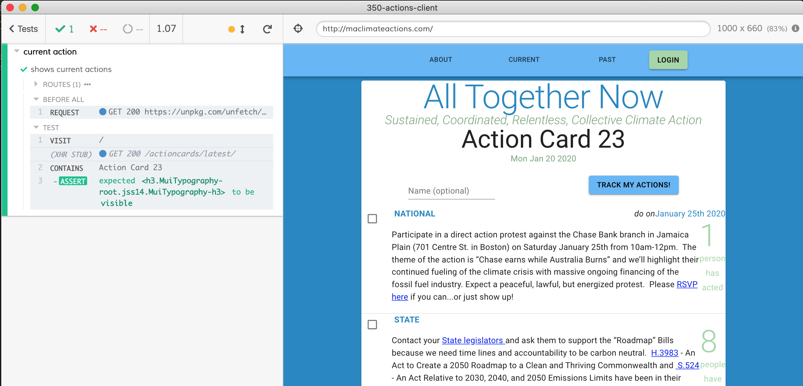

# 350-actions-client  [](https://app.netlify.com/sites/maclimateactions/deploys)

This project was bootstrapped with [Create React App](https://github.com/facebook/create-react-app).

## Available Scripts

In the project directory, you can run:

### `npm start`

Runs the app in the development mode.<br />
Open [http://localhost:3000](http://localhost:3000) to view it in the browser.

The page will reload if you make edits.<br />
You will also see any lint errors in the console.

### `npm test`

Launches the test runner in the interactive watch mode.<br />
See the section about [running tests](https://facebook.github.io/create-react-app/docs/running-tests) for more information.

### end-to-end tests

Full tests are written using [Cypress.io](https://github.com/cypress-io/cypress) test runner. See tests in [cypress/integration](cypress/integration) folder and its global settings in [cypress.json](cypress.json) file.

To start local client and open Cypress

```shell
npm run local:dev
```

Then click on a spec filename to open browser running tests.



Note: API responses might be stubbed during E2E tests using JSON fixtures in [cypress/fixtures](cypress/fixtures) folder.

### `npm run build`

Builds the app for production to the `build` folder.<br />
It correctly bundles React in production mode and optimizes the build for the best performance.

The build is minified and the filenames include the hashes.<br />
Your app is ready to be deployed!

See the section about [deployment](https://facebook.github.io/create-react-app/docs/deployment) for more information.

### `npm run eject`

**Note: this is a one-way operation. Once you `eject`, you can’t go back!**

If you aren’t satisfied with the build tool and configuration choices, you can `eject` at any time. This command will remove the single build dependency from your project.

Instead, it will copy all the configuration files and the transitive dependencies (Webpack, Babel, ESLint, etc) right into your project so you have full control over them. All of the commands except `eject` will still work, but they will point to the copied scripts so you can tweak them. At this point you’re on your own.

You don’t have to ever use `eject`. The curated feature set is suitable for small and middle deployments, and you shouldn’t feel obligated to use this feature. However we understand that this tool wouldn’t be useful if you couldn’t customize it when you are ready for it.

## VSCode setup

See [CRA editor setup section](https://create-react-app.dev/docs/setting-up-your-editor), [dbaeumer ESLint extension](https://marketplace.visualstudio.com/items?itemName=dbaeumer.vscode-eslint#overview) is recommended. I have added [.vscode](.vscode) folder to the repo, just to share good settings if you use this editor.

## Prettier

Code is formatted using Prettier, read [How to configure Prettier and VSCode](https://glebbahmutov.com/blog/configure-prettier-in-vscode/). Code can be formatted:

- right from your editor (like VSCode)
- by running `npm run format`
- automatically on commit using Git hook
- on CI using [.github/workflows/prettier.yml](.github/workflows/prettier.yml) GH Action

## Storybook

Storybook (https://storybook.js.org/) is enabled for development of UI components. To start storybook, run `npm run storybook`.

## Learn More

You can learn more in the [Create React App documentation](https://facebook.github.io/create-react-app/docs/getting-started).

To learn React, check out the [React documentation](https://reactjs.org/).

## License

MIT License, see [LICENSE.md](./LICENSE.md)
